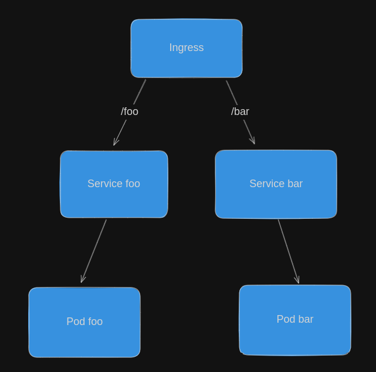

# Desafio SRE

## Arquitetura da aplicação

## Executando o exemplo
Instalando o minikube

`curl -LO https://storage.googleapis.com/minikube/releases/latest/minikube-linux-amd64`

`sudo install minikube-linux-amd64 /usr/local/bin/minikube && rm minikube-linux-amd64`

Subindo o cluster

`minikube start`

Instalando o addon necessário para o funcionamento do ingress

`minikube addons enable ingress`

Subindo o minikube dashboard

`minikube dashboard`

:warning: Garanta que você está executando o apply dentro do contexto do minikube, você pode confirmar isso rodando o senguinte comando `kubectl config current-context`. Caso esteja usando outro contexto você pode trocar usando o comando `kubectl config use-context minikube`

Agora você consegue subir a aplicação no seu minikube local usando o seguinte comando:

`kubectl apply -f foo-bar-app-example.yaml`

## Testando o exemplo
Pegue o ip do ingress para testar a aplicação, para isso basta executar:

`kubectl get ingress`

Abra seu navegar o testes as seguintes urls:
http://<ip_do_seu_ingress>/bar
http://<ip_do_seu_ingress>/foo

## Objetivo
Criar um chart helm para a aplicação kubernetes [foo-bar-app-example.yaml](foo-bar-app-example.yaml)
Para isso é importante que você entenda como funciona o helm charts e o kubernetes, seus comandos básicos e seus principais recusros (pod, service, deployment, ingress)

## Requisitos minimos
* Chart helm funcionando
* O chart deve receber alguns argumentos via Values para ser criado: 
    * nome do app foo
    * nome do app bar
    * porta do app foo
    * porta do app bar
    * imagem do app foo
    * imagem do app bar

## Elevando o nível do seu desafio (opicional):
* Customize o chart para receber via Values o path ingress do app foo e bar (Dificuldade: :star:)
* Habilite o [healthcheck] (https://kubernetes.io/docs/tasks/configure-pod-container/configure-liveness-readiness-startup-probes/) (Dificuldade: :star:)
* Crie template de [Deployment] (https://kubernetes.io/docs/concepts/workloads/controllers/deployment/) para que a aplicação possa ser escalavél (Dificuldade: :star::star:)
* Crie template de [HorizontalPodAutoscaler] (https://kubernetes.io/docs/tasks/run-application/horizontal-pod-autoscale/) (Dificuldade: :star::star::star:)
* Crie tests para seu chart [DOC](https://helm.sh/docs/topics/chart_tests/) (Dificuldade: :star::star::star::star::star:)
